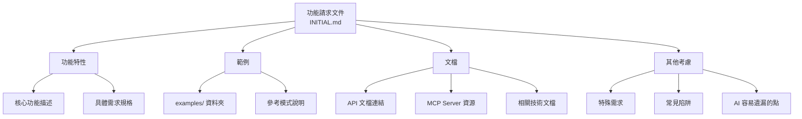

# 功能請求文件 (INITIAL.md)

## 功能請求結構圖

此圖展示了功能請求文件的組成結構，包含功能特性、範例、文檔和其他考慮事項：

## 功能特性：

[在此處插入您的功能特性]

## 範例：

[提供並解釋您在 `examples/` 資料夾中的範例]

## 文檔：

[列出開發過程中需要參考的任何文檔（網頁、MCP server 如 Crawl4AI RAG 等的源文件）]

## 其他考慮：

[任何其他考慮或特定要求 - 這裡很適合包含您在項目中經常看到 AI 編程助手遺漏的注意事項]
