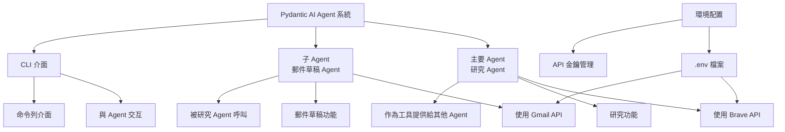
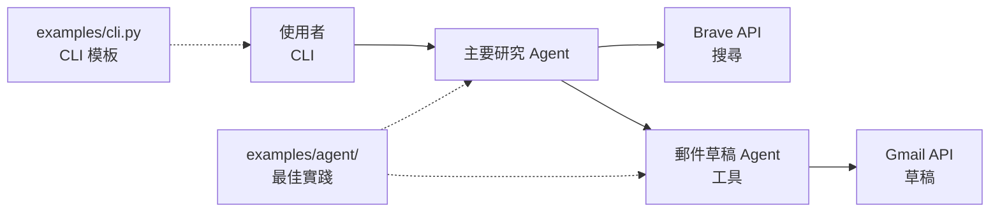

# 功能請求範例 - Pydantic AI Agent 系統

## 範例功能架構圖

此架構圖展示了 Pydantic AI Agent 系統的組成，包含主要 Agent、子 Agent、CLI 介面和環境配置：

---

## Agent 互動流程圖

以下流程圖說明了使用者如何透過 CLI 與各個 Agent 互動，以及 Agent 之間的調用關係：

## 功能特性：

- 一個 Pydantic AI agent，它使用另一個 Pydantic AI agent 作為工具。
- 主要 agent 的研究 Agent 和子 agent 的郵件草稿 Agent。
- 用於與 agent 交互的 CLI。
- 郵件草稿 agent 使用 Gmail，研究 agent 使用 Brave API。

## 範例：

在 `examples/` 資料夾中，有一個 README 供你閱讀，以了解範例的用途以及在為上述功能創建文檔時如何構建自己的 README。

- `examples/cli.py` - 使用這個作為創建 CLI 的模板
- `examples/agent/` - 閱讀這裡的所有文件，了解創建 Pydantic AI agents 的最佳實踐，包括支援不同的提供者和 LLM、處理 agent 依賴項以及為 agent 添加工具。

不要直接複製這些範例，它們是針對完全不同的項目。但請將其用作靈感和最佳實踐參考。

## 文檔：

Pydantic AI 文檔：https://ai.pydantic.dev/

## 其他考慮：

- 包含 .env.example、README 以及設置說明，包括如何配置 Gmail 和 Brave。
- 在 README 中包含項目結構。
- Virtual environment 已經設置好必要的依賴項。
- 使用 python_dotenv 和 load_env() 處理環境變數
