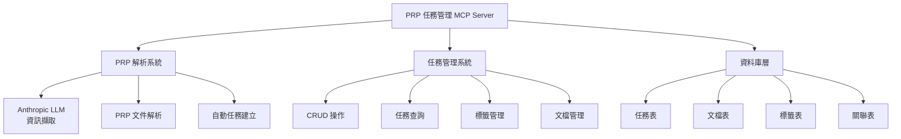
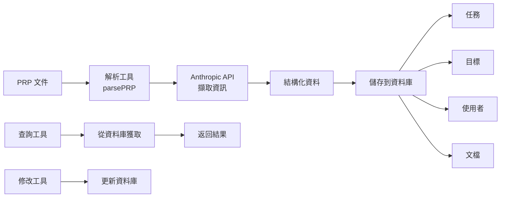

# MCP Server 功能需求 - PRP 任務管理系統

## 系統架構圖

## 資料流程圖

## FEATURE:

We want to create a MCP server using this repos template

The goal of the MCP server is to create a simple version of taskmaster mcp that instead of parsing PRDs we parse PRPs.

Additional features:

- LLM powered PRP information extraction using anthropic
- Crud operation on tasks, documentation, tags, etc to and from the DB

We need tools for parsing PRPs this tool should take a filled PRP and use anthropic to extract the tasks into tasks and save them to the db, including surrounding documentation from the prp like the goals what whys, target users, etc.

We need:

- To be able to perform CRUD operations on tasks, documentation, tags, etc
- A task fetch tool to get the tasks from the
- To be able to list all tasks
- To be able to add information to a task
- To be able to fetch the additional documentation from the db
- To be able to modify the additional documentation
- DB tables needs to be updated to match our new data models

## EXAMPLES & DOCUMENTATION:

All examples are already referenced in prp_mcp_base.md - do any additional research as needed.

## OTHER CONSIDERATIONS:

- Do not use complex regex or complex parsing patterns, we use an LLM to parse PRPs.
- Model and API key for Anthropic both need to be environment variables - these are set up in .dev.vars.example
- It's very important that we create one task per file to keep concerns separate