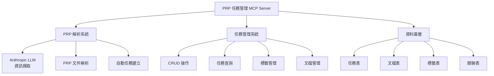
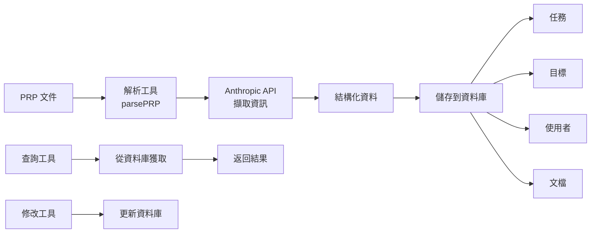

# MCP Server 功能需求 - PRP 任務管理系統

## 系統架構圖

以下架構圖展示了 PRP 任務管理 MCP Server 的核心組成，包含 PRP 解析系統、任務管理系統和資料庫層：

---

## 資料流程圖

此流程圖說明了從 PRP 文件解析到資料儲存和查詢的完整資料流程：

## 功能：

我們想要使用這個儲存庫的模板創建一個 MCP 伺服器

MCP 伺服器的目標是創建一個簡化版的 taskmaster mcp，但不是解析 PRDs，而是解析 PRPs。

額外功能：

- 使用 anthropic 進行 LLM 驅動的 PRP 資訊提取
- 對資料庫中的任務、文件、標籤等進行 CRUD 操作

我們需要用於解析 PRPs 的工具，此工具應該接收一個已填寫的 PRP，並使用 anthropic 提取任務並將其保存到資料庫中，包括來自 PRP 的相關文件，如目標、原因、目標使用者等。

我們需要：

- 能夠對任務、文件、標籤等執行 CRUD 操作
- 一個任務獲取工具，用於從資料庫獲取任務
- 能夠列出所有任務
- 能夠向任務添加資訊
- 能夠從資料庫獲取額外的文件
- 能夠修改額外的文件
- 資料庫表格需要更新以符合我們的新資料模型

## 範例與文件：

所有範例都已在 prp_mcp_base.md 中引用 - 根據需要進行任何額外的研究。

## 其他考量：

- 不要使用複雜的 regex 或複雜的解析模式，我們使用 LLM 來解析 PRPs。
- Anthropic 的模型和 API 金鑰都需要是環境變數 - 這些在 .dev.vars.example 中設置
- 非常重要的是，我們為每個檔案創建一個任務，以保持關注點分離